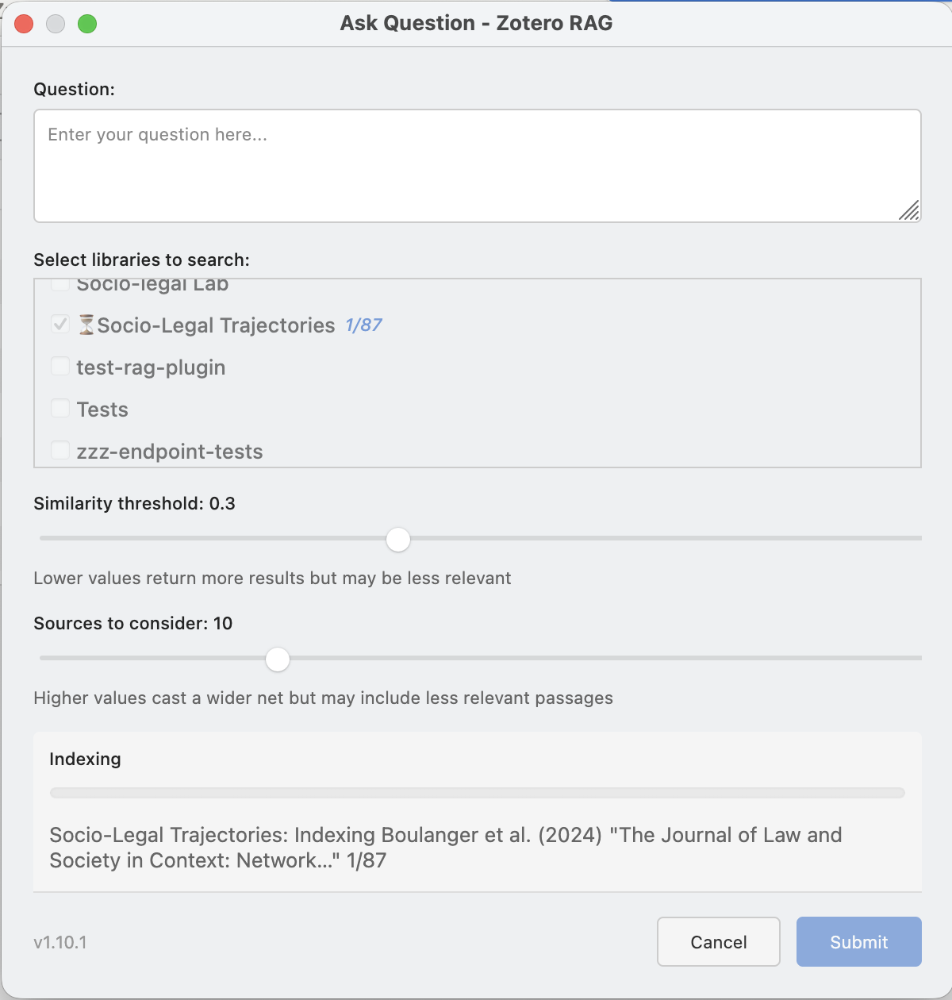

# Zotero RAG Plugin

<div style="diplay:grid">
    
    
</div>

This plugin implements a RAG (Retrieval-Augmented-Generation) System for Zotero which allows to ask questions on the literature in a library and get a response with links to the sources.


## Quick Start

### Install the dependencies

- [Install `uv`](https://docs.astral.sh/uv/getting-started/installation/) if you don't have it already.
- Install the python dependencies: `uv sync`
- Install a recent version of NodeJS (It's strictly only necessary for development)

For presets that run embedding models locally (`apple-silicon-32gb`, `high-memory`, `cpu-only`) you also need:

```bash
uv sync --extra local-models
```

Remote presets (`remote-kisski`, `remote-openai`, etc.) do **not** require these packages — see [docs/presets.md](docs/presets.md) for the full comparison.

### 2. Configure a Preset

Copy `.env.dist` to `.env` and set `MODEL_PRESET`:

```bash
# Recommended — fully remote, no local GPU or heavy dependencies
MODEL_PRESET=remote-kisski       # requires KISSKI_API_KEY
MODEL_PRESET=remote-openai       # requires OPENAI_API_KEY

# Local inference (requires uv sync --extra local-models)
MODEL_PRESET=apple-silicon-32gb  # Apple Silicon Mac, 32 GB RAM
MODEL_PRESET=cpu-only            # CPU only / low memory
```

See [docs/presets.md](docs/presets.md) for all presets and a dependency overview.

### 3. Start the Backend Server

The plugin requires a locally or remotely deployed server to process your questions. The server URL is configured in the plugin's Preferences pane (`http://localhost:8119` by default). When using a remote server, set an API key there and enter it in the plugin preferences.

**Option A — direct (development):**

```bash
# with NodeJS:
npm run server:start
# without NodeJS:
uv run python scripts/server.py start
```

Locally, the server will run at <http://localhost:8119>. You can check if it's running:

```bash
npm run server:status
curl http://localhost:8119/health
```

To stop the server:

```bash
npm run server:stop
```

**Option B — Docker container:**

```bash
# Build image and start container (requires Docker or Podman)
node bin/container.mjs start --data-dir ./data

# Or with a deployment env file (for servers):
node bin/deploy.mjs .env.deploy.myserver
```

See [docs/container-deployment.md](docs/container-deployment.md) for full Docker setup, including remote server deployment with nginx and SSL.

### 4. Install the Plugin in Zotero

1. Download the `zotero-rag-X.Y.Z.xpi` file from <https://github.com/cboulanger/zotero-rag/releases/latest>
2. Open Zotero
3. Go to **Tools → Add-ons**
4. Click the gear icon and select **Install Add-on From File**
5. Select the downloaded `.xpi` file
6. Restart Zotero when prompted

### 5. Configure the Plugin for a Remote Server

If the backend runs on a remote host, open **Zotero → Settings → Zotero RAG** and set:

- **Server URL** — the full URL of the remote server (e.g. `https://rag.example.com`)
- **API Key** — the server-side API key set during deployment (leave blank if the server has no key configured)
- **Service API Keys** — if the backend preset uses a remote LLM or embedding service (e.g. OpenAI, KISSKI), enter the corresponding API key here so the plugin can pass it to the server

### 6. Using the Plugin

Once installed:

1. Open your Zotero library
2. Select a library (user or group)
3. Open the "Tools" menu and then click on the "Zotero RAG" menu item
4. In the dialog, the current library will be pre-selected, but you can add additional ones to search.
5. Ask questions that can be answered by the PDF documents contained in the selected libraries
6. The plugin will search through your documents and provide answers with source citations. The initial indexing of the library might take some time depending on the server hardware, subsequent queries will be much faster.

The plugin uses AI to understand your questions and retrieve relevant information from your Zotero library, making it easy to find insights across multiple papers.

## Developer Documentation

- **[Application architecture](docs/architecture.md)**
- **[Plugin development & hot reload](docs/zotero-plugin-dev.md)**
- **[Testing Guide](docs/testing.md)**
- **[CLI commands](docs/cli.md)**
- **[Setup CI/CD](docs/setup-ci-cd.md)**

## License

The code is almost fully generated by Claude Code with an initial prompt and guidance by @cboulanger. It is therefore in the Public Domain as far as the code is machine-generated, otherwise it is licensed under Mozilla Public License (MPL) version 2.0.
