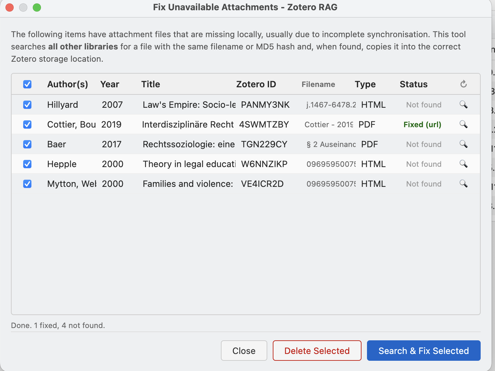

# Zotero RAG Plugin

<!-- markdownlint-disable MD033 -->

This plugin implements a RAG (Retrieval-Augmented-Generation) System for Zotero which allows to ask questions on the literature in a library and get a response with links to the sources.

## Quick Start

### Install the dependencies

- [Install `uv`](https://docs.astral.sh/uv/getting-started/installation/) if you don't have it already.
- Install the python dependencies: `uv sync`
- Install a recent version of NodeJS (It's strictly only necessary for development)

For presets that run embedding models locally (`apple-silicon-32gb`, `high-memory`, `cpu-only`) you also need:

```bash
uv sync --extra local-models
```

Remote presets (`remote-kisski`, `remote-openai`, etc.) do **not** require these packages — see [docs/presets.md](docs/presets.md) for the full comparison.

### 2. Configure a Preset

Copy `.env.dist` to `.env` and set `MODEL_PRESET`:

```bash
# Recommended — fully remote, no local GPU or heavy dependencies
MODEL_PRESET=remote-openai       # requires OPENAI_API_KEY

# Local inference (requires uv sync --extra local-models)
MODEL_PRESET=apple-silicon-32gb  # Apple Silicon Mac, 32 GB RAM
MODEL_PRESET=cpu-only            # CPU only / low memory, will have bad performance
```

See [docs/presets.md](docs/presets.md) for all presets and a dependency overview.

### 3. Start the Backend Server

The plugin requires a locally or remotely deployed server to process your questions. The server URL is configured in the plugin's Preferences pane (`http://localhost:8119` by default). When using a remote server, set an API key there and enter it in the plugin preferences.

**Option A — direct (development):**

```bash
# with NodeJS:
npm run server:start
# without NodeJS:
uv run python scripts/server.py start
```

Locally, the server will run at <http://localhost:8119>. You can check if it's running:

```bash
npm run server:status
curl http://localhost:8119/health
```

To stop the server:

```bash
npm run server:stop
```

**Option B — Docker container:**

```bash
# Build image and start container (requires Docker or Podman)
node bin/container.mjs start --data-dir ./data

# Or with a deployment env file (for servers, works only with Podman):
node bin/deploy.mjs .env.deploy.example
```

See [docs/container-deployment.md](docs/container-deployment.md) for full Docker setup, including remote server deployment with nginx and SSL.

### 4. Install the Plugin in Zotero

1. Download the `zotero-rag-X.Y.Z.xpi` file from <https://github.com/cboulanger/zotero-rag/releases/latest>
2. Open Zotero
3. Go to **Tools → Add-ons**
4. Click the gear icon and select **Install Add-on From File**
5. Select the downloaded `.xpi` file
6. The plugin will be installed and will auto-update if so configured.

### 5. Configure the Plugin for a Remote Server

If the backend runs on a remote host, open **Zotero → Settings → Zotero RAG** and set:

- **Server URL** — the full URL of the remote server (e.g. `https://rag.example.com`)
- **API Key** — the server-side API key set during deployment (leave blank if the server has no key configured)
- **Service API Keys** — if the backend preset uses a remote LLM or embedding service (e.g. OpenAI, KISSKI), enter the corresponding API key here so the plugin can pass it to the server

### 6. Using the Plugin


Once installed:

1. Open your Zotero library
2. Select a library (user or group)
3. Open the "Tools" menu and then click on the "Zotero RAG" menu item
4. In the dialog, the current library will be pre-selected, but you can add additional ones to search (this works only if all of them have already been indexed)
5. If the library has not been indexed, you will not be able to ask a question on this library but need to index it first. This might take from minutes to hours depending on the size of the library.
6. Once indexed, you can ask questions that can be answered by the PDF documents contained in the selected libraries. The plugin will search through your documents and provide answers with source citations.

The plugin uses AI to understand your questions and retrieve relevant information from your Zotero library, making it easy to find insights across multiple papers.


#### Public Web Interface

The backend can optionally expose a browser-accessible query UI at `/public/` that lets anyone query a publicly readable Zotero library **without** the Zotero plugin or an API key.

**1. Make sure the Zotero library is set to *Public* in your Zotero.org account settings.**

**2. Create a config file** (use [`public-libraries.example.json`](public-libraries.example.json) as a template):

```json
{
  "users/1234567": {
    "title": "My Research Library",
    "description": "Papers on computational linguistics.",
    "placeholder": "e.g. What methods are used for cross-lingual transfer?"
  },
  "groups/9876543": {
    "title": "DH Working Group",
    "description": "Digital humanities reading list."
  }
}
```

Keys are Zotero.org library slugs (`users/{userId}` or `groups/{groupId}`). The optional `placeholder` field customises the hint text in the question input; `title` and `description` are shown on the query page.

**3. Point the server at the file** by adding this line to your `.env`:

```env
PUBLIC_LIBRARIES_CONFIG=/path/to/public-libraries.json
```

**4. (Re)start the server.** The UI is then available at:

| URL | Page |
| --- | --- |
| `/public/` | Index listing all configured libraries |
| `/public/users/{id}` | Query form + results for a user library |
| `/public/groups/{id}` | Query form + results for a group library |

Results include inline citations linked to the corresponding item on `www.zotero.org`, with author/year labels fetched from the Zotero web API. Libraries that are not listed in the config file return **403 Forbidden**.

> **Note:** The public UI only works for libraries that have already been indexed in **this running backend instance** via the Zotero plugin. It does not provide access to arbitrary public Zotero libraries — the library must first be indexed locally before queries can be answered.

#### Fix Unavailable Attachments



If Zotero sync is incomplete, some attachment files may be missing locally even though the metadata exists. The plugin detects this and shows a warning badge (e.g. **⚠ 3**) in the Zotero toolbar, or a message "x unavailable" in the list of libraries after indexing. Click on the badge or on that message to open the **Fix Unavailable Attachments** dialog, which lists all affected items in the current library.

For each missing file the tool tries the following strategies in order:

1. **Zotero sync download** — triggers the normal Zotero file sync for that attachment.
2. **Filename match** — searches all other libraries for an attachment with the same filename.
3. **MD5 hash match** — searches by the file's stored sync hash (`storageHash`).
4. **`owl:sameAs` relations** — follows cross-library item relations to find the same file elsewhere.
5. **Direct URL download** — downloads from the attachment's stored URL using Zotero's proxy-aware HTTP client.
6. **DOI / Open Access resolver** — uses Zotero's built-in file resolvers (Unpaywall, etc.) to locate a freely available copy.

When a file is found it is copied into the correct Zotero storage directory. Items that cannot be recovered can be deleted permanently from the dialog using the **Delete Selected** button.

## Versioning and Release Policy

The project uses [Semantic Release](https://github.com/semantic-release/semantic-release) workflow, which relies on [Semantic Versioning](https://semver.org/) principles. This determines the version number. The major version increases each time a backwards-incompatible change is being merged in terms of the frontend (plugin client) and backend (server) communication. All backend and frontend instances with the same major version number should be compatible and will handle missing new features gracefully.

Exception: version 1.x.y is beta, anything can change anytime. v2.0.0 will be the first stable release.

## Developer Documentation

- **[Application architecture](docs/architecture.md)**
- **[Plugin development & hot reload](docs/zotero-plugin-dev.md)**
- **[Testing Guide](docs/testing.md)**
- **[CLI commands](docs/cli.md)**
- **[Setup CI/CD](docs/setup-ci-cd.md)**
- **[Resources for coding agents](docs/agents.md)**

## License

The code is almost fully generated by Claude Code with an initial prompt and guidance by @cboulanger. It is therefore in the Public Domain as far as the code is machine-generated, otherwise it is licensed under Mozilla Public License (MPL) version 2.0.
