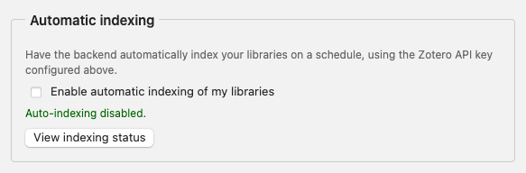
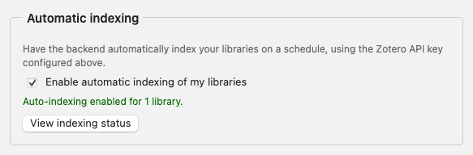
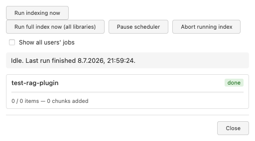
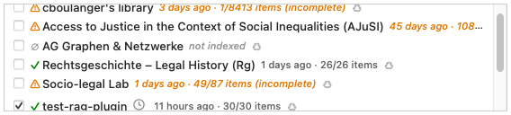

# Automatic Indexing Setup

Automatic indexing keeps a library searchable in Zotero RAG without you having
to open Zotero and index it by hand. Once enabled, the server periodically
re-syncs the library on its own schedule — new items get indexed, changed
items get re-indexed, and deleted items get removed from the index.

This is especially useful for **group libraries**: if you're the person who
set up the group, enabling automatic indexing for your own key means the
whole group's library stays current for every member who queries it, without
anyone needing to keep Zotero running.

This page covers the plugin UI only. If you're a server operator looking for
the underlying script, scheduler configuration, or cron setup, see
[Cron / Headless Indexing](cron-indexing.md) instead.

## Prerequisites

- The plugin must already be configured for a remote server (Server URL +
  your personal Zotero API key), via the setup wizard or
  **Zotero → Settings → Zotero RAG**.
- For security reasons, your Zotero API key must be **read-only**. This is the same key you use for
  normal plugin queries — there is no separate key to create. If your key has
  write access, the server will reject it when you try to enable automatic
  indexing; create a read-only key at
  [zotero.org/settings/keys](https://www.zotero.org/settings/keys) instead.
- If the backend preset you're using requires a service API key for
  embeddings (e.g. an OpenAI or KISSKI key), that key must already be entered
  and accepted in the same Preferences pane — otherwise indexing runs will be
  skipped until it is.

## Step 1: Enable automatic indexing

Open **Zotero → Settings → Zotero RAG** and scroll to the **Automatic
indexing** section.

Check **"Enable automatic indexing of my libraries"**. The server registers
your key and resolves every library it can read.

The status line below the checkbox confirms how many libraries were
registered, or explains what's missing (e.g. a not-yet-configured embedding
key).

## Step 2: Check indexing status

Click **"View indexing status"** to open a dialog with the current/last run:

- **Run indexing now** — triggers an immediate run of your own registered
  libraries, without waiting for the next scheduled tick.
- The panel below lists each library with its status (`pending`, `indexing`,
  `done`, or `error`) and item/chunk counts for the current run.

You don't need to keep this dialog open — indexing continues on the server
regardless. It's just a way to check progress.

## The clock icon

In the library-selection list of the main query dialog, libraries registered
for automatic indexing are marked with a small clock icon next to their name:

This tells you the library is kept up to date by the server on its own — you
don't need to index it manually before asking questions.

## Admin controls

If your Zotero account is an **owner or admin** of the Zotero group that
authorizes this server (as configured by the server operator), the status
dialog shows additional controls affecting **every** registered library, not
just your own:

| Control | Effect |
|---|---|
| **Run full index now (all libraries)** | Triggers an immediate run covering every registered library on the server, not just yours |
| **Pause scheduler** / **Resume scheduler** | Pauses or resumes the server's automatic schedule entirely |
| **Abort running index** | Stops the entire in-progress run — use only if it's genuinely stuck, since it forces every affected library to fully re-sync on the next run |
| **Show all users' jobs** | Reveals every library and owner in the current run, not just your own |
| **Skip this job** (per-library, while a run is active) | Cooperatively skips just that one library without stopping the rest of the run |

Prefer **Skip this job** over **Abort** when only a single library is
misbehaving — it leaves everything else undisturbed.

## Disabling automatic indexing

Uncheck **"Enable automatic indexing of my libraries"** in Preferences. Your
key is removed from the schedule immediately; libraries you registered will
no longer be re-indexed automatically (existing index content is untouched).

## Troubleshooting

- **Checkbox is greyed out** — configure your Zotero API key in the
  **Backend Server** section above first; automatic indexing has nothing to
  register without it.
- **"Automatic indexing is not available on this server"** — the server
  operator hasn't enabled this feature yet; contact them.
- **"...but no embedding API key is configured"** / **"...was rejected"** —
  add or fix the required service API key further up the same Preferences
  pane, then re-check the box (or wait for the next scheduled run).
- **Key rejected when enabling** — your Zotero API key has write access;
  replace it with a read-only key from
  [zotero.org/settings/keys](https://www.zotero.org/settings/keys).
