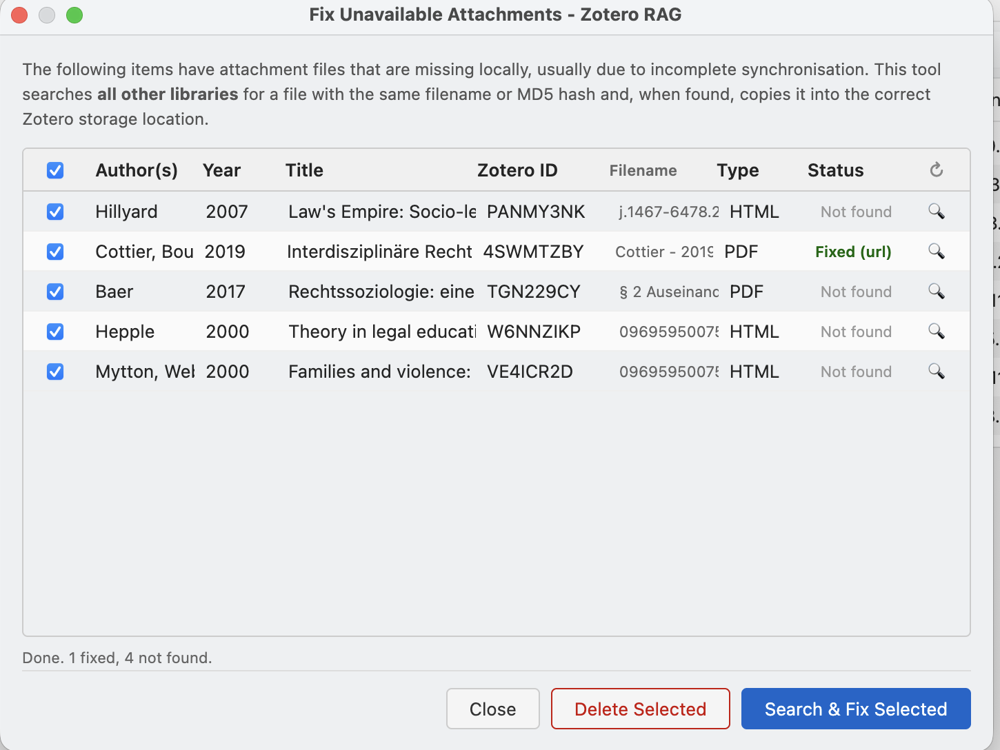

# Fix Unavailable Attachments

If Zotero sync is incomplete, some attachment files may be missing locally
even though the metadata exists. The plugin detects this and shows a warning
badge (e.g. **⚠ 3**) in the Zotero toolbar, or a message "x unavailable" in
the list of libraries after indexing.

Click on the badge or on that message to open the **Fix Unavailable
Attachments** dialog, which lists all affected items in the current library.

## Recovery strategies

For each missing file the tool tries the following strategies in order:

1. **Zotero sync download** — triggers the normal Zotero file sync for that
   attachment.
2. **Filename match** — searches all other libraries for an attachment with
   the same filename.
3. **MD5 hash match** — searches by the file's stored sync hash
   (`storageHash`).
4. **`owl:sameAs` relations** — follows cross-library item relations to find
   the same file elsewhere.
5. **Direct URL download** — downloads from the attachment's stored URL using
   Zotero's proxy-aware HTTP client.
6. **DOI / Open Access resolver** — uses Zotero's built-in file resolvers
   (Unpaywall, etc.) to locate a freely available copy.

When a file is found it is copied into the correct Zotero storage directory.
Items that cannot be recovered can be deleted permanently from the dialog
using the **Delete Selected** button.

## Attachments that failed server-side text extraction

Some rows in this dialog aren't missing files at all — the attachment downloaded
successfully, but the backend's text-extraction step (Kreuzberg) couldn't produce
usable content from it. These show up with "timeout" or "empty" in the Type/Status
columns:

- **timeout** — extraction ran out of time, most often on very large or
  OCR-heavy files. Clicking **Search & Fix Selected** automatically retries these
  once with double the normal extraction timeout before giving up. If it still
  times out, the row is left for manual handling (delete the item, or raise the
  server's `KREUZBERG_TIMEOUT_SECONDS` setting and reindex).
- **empty** — extraction completed but produced no text at all (e.g. an
  image-only PDF with OCR disabled, or a genuinely blank document). A longer
  timeout can't produce text that isn't there, so these are never auto-retried —
  only deleting the item or reindexing after a configuration change (e.g.
  enabling OCR) can resolve them.
